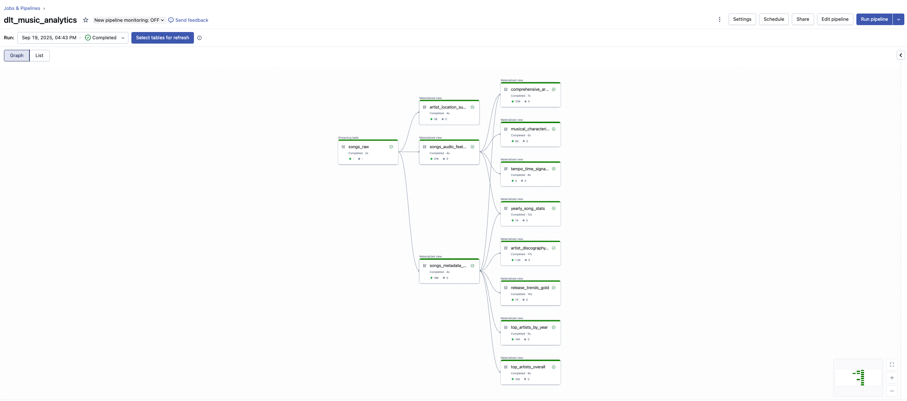

# Music Analytics - Databricks Lakeflow Declarative Pipeline

## Overview

This directory contains a **Lakeflow Declarative Pipeline (LDP)** implementation for processing and analyzing the Million Song Dataset. The pipeline demonstrates modern data engineering patterns using declarative transformations with streaming data ingestion and comprehensive data quality validation.

## Pipeline Architecture - Medallion Pattern

```
┌─────────────────────────────────────────────────────────────────────────────┐
│                           MEDALLION ARCHITECTURE                            │
│                      Lakeflow Declarative Pipelines                         │
└─────────────────────────────────────────────────────────────────────────────┘

🥉 BRONZE LAYER (Raw Data)
┌─────────────────────────────────────────────────────────────────────────┐
│  📁 songs_raw                                                           │
│  ┌────────────────────────────────────────────────────────────────────┐ │
│  │ • Raw CSV ingestion via Auto Loader                                │ │
│  │ • Tab-separated Million Song Dataset                               │ │
│  │ • 20 fields: artist info, song metadata, audio features            │ │
│  │ • Streaming ingestion with schema enforcement                      │ │
│  │ • Source: /databricks-datasets/songs/data-001                      │ │
│  └────────────────────────────────────────────────────────────────────┘ │
└──────────────────────────────────────────────────────────────────────────┘
                                    │
                                    ▼
🥈 SILVER LAYER (Specialized & Validated)
┌─────────────────────────────────────────────────────────────────────────┐
│  📊 songs_metadata_silver         🎵 songs_audio_features_silver        │
│  ┌─────────────────────────────┐   ┌─────────────────────────────────┐   │
│  │ • Release & temporal data   │   │ • Musical characteristics       │   │
│  │ • Artist discography info   │   │ • Tempo & rhythm analysis       │   │
│  │ • Duration & year metadata  │   │ • Time signature patterns       │   │
│  │ • @dlt.expect validations:  │   │ • @dlt.expect validations:      │   │
│  │   ✓ Release years 1900-2030 │   │   ✓ Tempo range 40-250 BPM     │   │
│  │   ✓ Non-null titles/artists │   │   ✓ Time signatures 1-12       │   │
│  │   ✓ Duration 10-3600 seconds│   │   ✓ Reasonable song durations   │   │
│  └─────────────────────────────┘   └─────────────────────────────────┘   │
└─────────────────────────────────────────────────────────────────────────┘
                                    │
                                    ▼
🥇 GOLD LAYER (Advanced Analytics)
┌──────────────────────────────────────────────────────────────────────────┐
│  📊 Temporal Analytics           🎨 Artist Analytics      🎵 Musical Analysis│
│  ┌─────────────────────────┐    ┌─────────────────────┐  ┌──────────────────┐ │
│  │ 🎯 top_artists_by_year  │    │ 🏆 top_artists_overall│  │ 🎼 musical_characteristics│
│  │ 📈 yearly_song_stats    │    │ 📀 artist_discography │  │ 🥁 tempo_time_signature   │
│  │ 📅 release_trends_gold  │    │ 👤 comprehensive_profile│  │ _analysis_gold            │
│  │ 🌍 artist_location_sum  │    └─────────────────────┘  └──────────────────┘ │
│  └─────────────────────────┘                                                │
│                                                                              │
│  Features:                                                                   │
│  • Year-over-year trends    • Career span analysis    • Tempo distributions │
│  • Geographic patterns      • Discography metrics     • Time signature stats│
│  • Release productivity     • Musical consistency     • Style categorization│
│  • Temporal aggregations    • Artist profiling        • Audio feature analysis│
└──────────────────────────────────────────────────────────────────────────────┘
```

## Pipeline Visualization



*Figure 1: Lakeflow Declarative Pipeline flow for the Million Song Dataset showing the medallion pattern data flow from raw ingestion through analytics-ready gold layer views in the Datarbicks Platform*

## Data Schema

The pipeline processes 20 fields from the Million Song Dataset:

### Core Fields
- **Artist Information**: `artist_id`, `artist_name`, `artist_location`, `artist_lat`, `artist_long`
- **Song Metadata**: `song_id`, `title`, `release`, `year`
- **Audio Features**: `duration`, `tempo`, `loudness`, `key`, `time_signature`
- **Audio Analysis**: `key_confidence`, `time_signature_confidence`, `song_hotnes`
- **Audio Timing**: `end_of_fade_in`, `start_of_fade_out`

## Pipeline Components

### 1. Bronze Layer: Raw Data Ingestion

#### `songs_raw`
```python
@dlt.table
def songs_raw():
    """Streaming ingestion with Auto Loader"""
```
- **Technology**: Databricks Auto Loader with cloudFiles
- **Format**: Tab-separated CSV files
- **Schema**: Explicit StructType with 20 fields including artist metadata, song information, and audio features
- **Processing**: Streaming incremental ingestion from Million Song Dataset
- **Purpose**: Foundation layer capturing raw music data with all original fields intact

### 2. Silver Layer: Specialized Data Preparation & Quality

#### `songs_metadata_silver`
```python
@dlt.table
@dlt.expect("valid_release_year", "year > 1900 AND year <= 2030")
@dlt.expect("valid_song_title_metadata", "song_title IS NOT NULL AND trim(song_title) != ''")
@dlt.expect("valid_artist_name_metadata", "artist_name IS NOT NULL AND trim(artist_name) != ''")
@dlt.expect("valid_release_info", "release IS NOT NULL AND trim(release) != ''")
@dlt.expect("reasonable_duration_metadata", "duration > 10 AND duration < 3600")
def songs_metadata_silver():
```
- **Focus**: Song metadata, releases, and temporal information
- **Fields**: song_title, artist_name, artist_id, release, year, duration
- **Data Quality**: Comprehensive validation for release years, non-null titles/artists, reasonable durations
- **Use Cases**: Release analysis, temporal trends, discography research

**Example Queries:**
1. "Which artists released the most albums in the 1990s?"
2. "What's the average song duration by decade across different genres?"
3. "Which releases contained the most tracks and when were they published?"

#### `songs_audio_features_silver`
```python
@dlt.table
@dlt.expect("valid_tempo_range", "tempo > 40 AND tempo < 250")
@dlt.expect("valid_time_signature_range", "time_signature >= 1 AND time_signature <= 12")
@dlt.expect("valid_song_title_audio", "song_title IS NOT NULL AND trim(song_title) != ''")
@dlt.expect("valid_artist_name_audio", "artist_name IS NOT NULL AND trim(artist_name) != ''")
@dlt.expect("reasonable_duration_audio", "duration > 10 AND duration < 3600")
def songs_audio_features_silver():
```
- **Focus**: Musical characteristics and audio analysis features
- **Fields**: song_title, artist_name, tempo, time_signature, duration
- **Data Quality**: Validates realistic tempo ranges (40-250 BPM), time signatures (1-12), and song durations
- **Use Cases**: Musical style analysis, tempo research, rhythmic pattern studies

**Example Queries:**
1. "What's the distribution of tempo across different time signatures in modern music?"
2. "Which artists have the most consistent tempo patterns in their catalog?"
3. "How has the average song tempo changed over the decades?"

### 3. Gold Layer: Advanced Analytics Views

#### `top_artists_by_year`
```python
@dlt.table
def top_artists_by_year():
```
- **Purpose**: Artists ranked by song count per year
- **Fields**: artist_name, year, total_number_of_songs
- **Sorting**: By productivity (song count) and chronologically
- **Source**: songs_metadata_silver

**Example Queries:**
1. "Who was the most prolific artist in 1985 and how many songs did they release?"
2. "Which years saw the highest number of releases from top artists?"
3. "How did artist productivity change during different music eras?"

#### `top_artists_overall`
```python
@dlt.table
def top_artists_overall():
```
- **Purpose**: All-time artist song counts and career-spanning productivity
- **Fields**: artist_name, total_number_of_songs
- **Sorting**: By total song count (descending)
- **Source**: songs_metadata_silver

**Example Queries:**
1. "Which 10 artists have the largest catalogs in the entire dataset?"
2. "How many songs separate the most prolific artist from the 50th most prolific?"
3. "What percentage of total songs do the top 100 artists represent?"

#### `yearly_song_stats`
```python
@dlt.table
def yearly_song_stats():
```
- **Purpose**: Year-over-year summary statistics combining metadata and audio features
- **Fields**: year, song_count, avg_duration_seconds, max/min_duration, avg_tempo_bpm, median_tempo_bpm
- **Analysis**: Temporal trends in music characteristics and production volume
- **Source**: Join of songs_metadata_silver and songs_audio_features_silver

**Example Queries:**
1. "How has the average song duration evolved from the 1960s to the 2000s?"
2. "Which year had the fastest average tempo and what was the median BPM?"
3. "In which decades did song production volume peak and decline?"

#### `artist_location_summary`
```python
@dlt.table
def artist_location_summary():
```
- **Purpose**: Geographic distribution of musical output with location-based characteristics
- **Fields**: location, songs_from_location, avg_duration_seconds, avg_tempo_bpm
- **Analysis**: Regional music patterns and geographical audio characteristics
- **Source**: Raw data (includes location field not in silver tables)

**Example Queries:**
1. "Which cities or regions produce the most music and what are their typical tempos?"
2. "Do artists from certain geographic locations tend to create longer or shorter songs?"
3. "How does the average tempo vary between different countries or regions?"

#### `release_trends_gold`
```python
@dlt.table
def release_trends_gold():
```
- **Purpose**: Release patterns, temporal analysis, and album productivity metrics
- **Fields**: year, total_songs_released, unique_releases, active_artists, duration statistics, songs_per_release
- **Analysis**: Music industry productivity trends and release behavior over time
- **Source**: songs_metadata_silver

**Example Queries:**
1. "Which years had the highest ratio of songs per release (indicating longer albums)?"
2. "How has the number of active artists changed over different decades?"
3. "What's the relationship between total song releases and unique album releases by year?"

#### `artist_discography_gold`
```python
@dlt.table
def artist_discography_gold():
```
- **Purpose**: Comprehensive artist catalog analysis with career metrics
- **Fields**: artist_name, total_songs, album_count, career_start/end_year, career_span_years, songs_per_album, total_catalog_duration
- **Analysis**: Artist career longevity, productivity patterns, and catalog characteristics
- **Source**: songs_metadata_silver (filtered for artists with 3+ songs)

**Example Queries:**
1. "Which artists had the longest careers and maintained consistent output?"
2. "What's the average number of songs per album for the most prolific artists?"
3. "Who has the largest total catalog duration and how many hours of music is that?"

#### `musical_characteristics_gold`
```python
@dlt.table
def musical_characteristics_gold():
```
- **Purpose**: Audio feature distributions and musical style categorization
- **Fields**: tempo_category, time_signature, duration_category, song_count, tempo/duration averages
- **Analysis**: Musical style patterns with categorical tempo (Slow/Medium/Fast/Very Fast) and duration groupings
- **Source**: songs_audio_features_silver

**Example Queries:**
1. "What's the most common combination of tempo category and time signature?"
2. "Do fast tempo songs tend to be shorter or longer in duration?"
3. "Which time signatures are most associated with very fast tempo music?"

#### `tempo_time_signature_analysis_gold`
```python
@dlt.table
def tempo_time_signature_analysis_gold():
```
- **Purpose**: Deep analysis of tempo and time signature relationships with statistical distributions
- **Fields**: time_signature, song_count, tempo statistics (avg, min, max, quartiles, stddev), popularity_rank
- **Analysis**: Detailed tempo patterns by time signature including variability and popularity rankings
- **Source**: songs_audio_features_silver

**Example Queries:**
1. "Which time signature has the widest tempo range and highest tempo variability?"
2. "What are the tempo quartiles for the most popular time signatures?"
3. "How does tempo consistency vary between different rhythmic patterns?"

#### `comprehensive_artist_profile_gold`
```python
@dlt.table
def comprehensive_artist_profile_gold():
```
- **Purpose**: Combined artist analysis merging discography and musical style characteristics
- **Fields**: artist_name, career metrics, musical consistency rating, tempo diversity, time_signature_diversity
- **Analysis**: Holistic artist profiles combining career span, productivity, and musical style consistency
- **Source**: Join of songs_metadata_silver and songs_audio_features_silver (filtered for artists with 5+ songs)

**Example Queries:**
1. "Which artists show the most musical diversity in their tempo and time signature choices?"
2. "Who are the most musically consistent artists versus those with the most experimental styles?"
3. "What's the relationship between career span and musical style diversity for top artists?"

## Key Features

### Lakeflow Declarative Pipelines Pattern
- **Declarative**: `@dlt.table` decorators for transformation definition
- **Quality-First**: Built-in data expectations and validation
- **Streaming**: Real-time processing with Auto Loader
- **Lineage**: Automatic dependency tracking between tables

### Data Quality & Validation
- Comprehensive `@dlt.expect` rules for data integrity
- Automatic handling of data quality violations
- Schema enforcement at ingestion

### Scalable Architecture
- Medallion pattern for clear data progression
- Separation of concerns: raw → cleaned → analytics
- Optimized for both streaming and batch workloads

## File Structure

```
src/py/ldp/music_analytics/
├── transformations/
│   └── dlt_songs_pipeline.py       # Main pipeline definition
└── README.md                        # This documentation
```

## Usage

This pipeline is designed to run in a Databricks environment with Delta Live Tables support. The transformations automatically create a dependency graph ensuring proper execution order from bronze through gold layers.

## Technology Stack

- **Databricks**: Unified analytics platform
- **Delta Live Tables**: Declarative pipeline framework
- **PySpark**: Distributed data processing
- **Auto Loader**: Streaming file ingestion
- **Million Song Dataset**: Rich music metadata and audio features

The pipeline showcases modern data engineering best practices with emphasis on data quality, streaming capabilities, and analytics-ready output for music industry insights.
